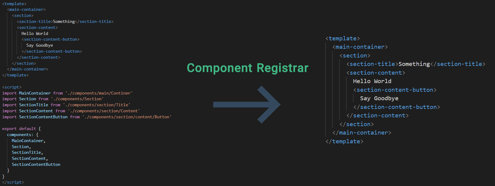
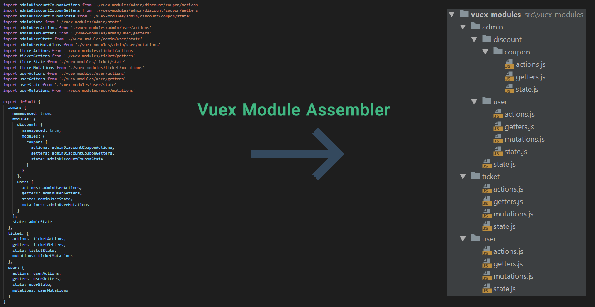

<p align="center">
  <a href="https://amirrezanasiri.github.io/vue-registrar/">
    
  </a>
  <h1 align="center">Vue Registrar</h1>
</p>

<p align="center">
  A dynamic component registrar and Vuex module assembler
</p>

<p align="center">
    <a href="https://www.npmjs.com/package/vue-registrar"></a>
    <a href="https://travis-ci.org/AmirrezaNasiri/vue-registrar"></a>
    
    
    <a href="https://standardjs.com/"></a>
</p>
<br>

A Vue.js package that makes your code a lot cleaner and much more understandable.

## Quick Start
🔥 Let just <a href="https://amirrezanasiri.github.io/vue-registrar/#/getting-started/installation"><strong>get started!</strong></a>!

## What is this technically?
Vue Registrar is consisted of two features that:
 * Registers all your common and frequently used components globally and ends the need for importing them manually;
 * Assembles all your vuex modules in a nested manner.   
 
👉 <a href="https://amirrezanasiri.github.io/vue-registrar/#/getting-started/installation"><strong>See documents and get started</strong></a>
 
## Why should I use it?
No more words! see yourself:   

### Using Component Registrar


If you're familiar with following structure:
```vue
// hello-world.vue
<template> ... </template>
<script>
import SomethingCommon from './path/to/it'
export default {
  components: { SomethingCommon }
}
</script>
```
You may need this feature! By using that, you just need to consider your template:
```vue
// hello-world.vue
<template> ... </template>
```

### Using Vuex Module Assembler


If you're using Vuex modules (especially in a nested or namespaced manner) like this:
```javascript
// store.js
import moduleAlphaState from './path/to/moduleAlpha/state'
import moduleAlphaActions from './path/to/moduleAlpha/actions'
import moduleBeta from './path/to/moduleBeta'

export default {
  a: {
    state: moduleAlphaState,
    actions: moduleAlphaActions,
    namespaced: true,
    modules: {
      nestedB: moduleBeta
    }
  }
}
</script>
```
You'll need this feature. By using it, you don't need to do anything else! just follow a simple directory structure:
```
vuex-modules/
└── a
    ├── actions.js
    ├── state.js
    └── b
        ├── actions.js
        ├── getters.js
        ├── mutations.js
        └── state.js
```

## Contribution
Any kind of help is appreciated! Feel free to report bugs, extend functionality and features. Pull Requests will be reviewed as soon as possible.

## License
Code is licensed under the [MIT License](LICENSE).

# See Also
* [ByteGate](https://bytegate.ir/) (our blog)
* [تبدیل PDF به ورد](http://delix.ir/) (our sponsored service)
